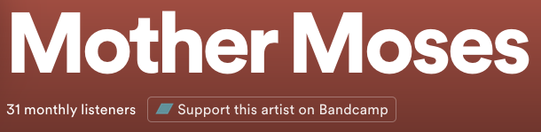

# bc-nudge (working title)

Templated from [browser-extension-template](https://github.com/notlmn/browser-extension-template). Under development by [Jean](https://github.com/jeancochrane) and [Addie](https://github.com/addiebarron) :)

## Development

Use `npm run dev` to open a Firefox instance with the extension running as a temporary add-on. The extension and any running scripts (not the browser or current page) will auto-reload when changes are detected. Uses `web-ext run` and `webpack --watch` under the hood.

> ⚠️   `web-ext run` requires a couple of fields to be valid & consistent in the manifest.json, including `name`, `homepage_url`, and `applications.gecko.id`, so we shouldn't edit those yet.

## Functionality

The extension adds an extra element into the Spotify Web UI which links to the artist's Bandcamp page, if one is found. Only artist and album pages are affected.

## TODO

- Content scripts cannot make fetch requests in Chrome. Move bandcamp-search-scraper calls to background.js
- Differentiate between errors and no-results conditions?

## Wishlist

- Cache previously visited artists.
- Option to add bandcamp accounts to artists with differing names, or specify a bandcamp page that is different from the detected one.
- When Bandcamp search improves, or a public API is released: search by album specifically.
